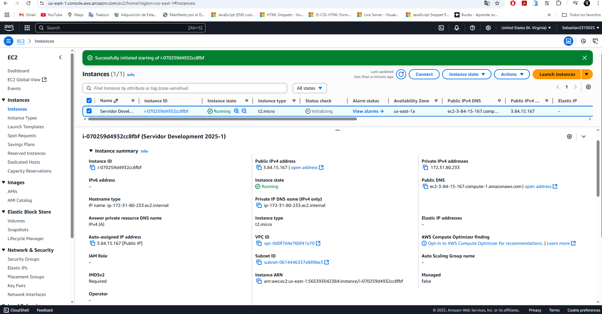
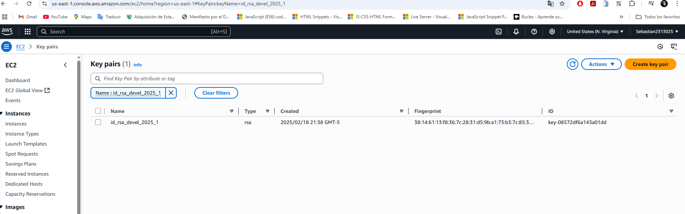
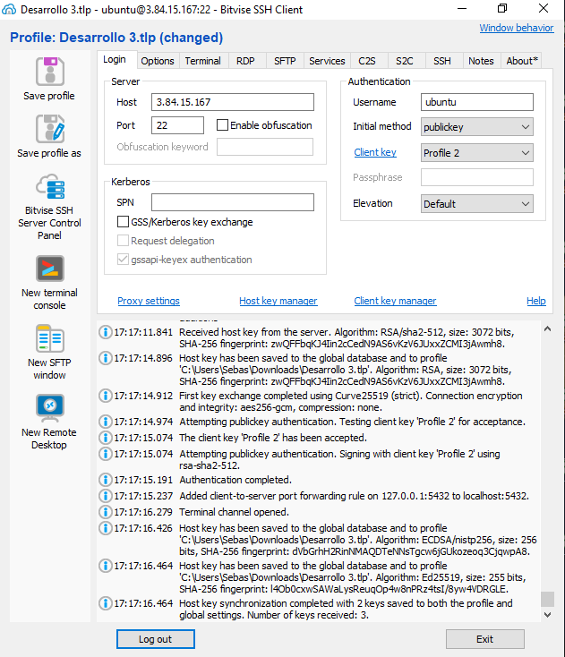
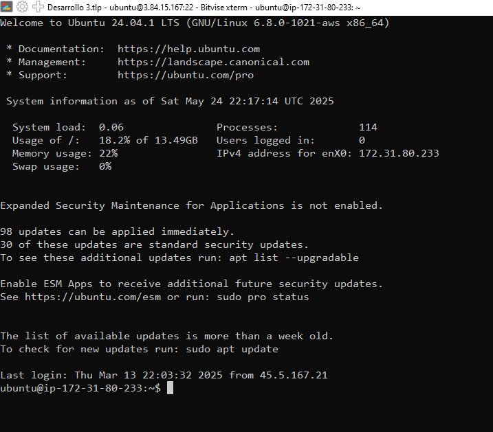

# Recursos - Amazon EC2

- **AMIs.PNG**  
  Imagen ilustrativa de cómo seleccionar una Amazon Machine Image (AMI) al crear una instancia.

  

- **Instancia.PNG**  
  Captura de pantalla del proceso de configuración de una nueva instancia EC2.
    

- **Key.PNG**  
  Muestra el paso donde se genera y descarga una clave privada para el acceso SSH.
    

- **SSH.PNG**  
  Ejemplo de una conexión SSH exitosa a una instancia de EC2.
    

- **Xterm.PNG**  
  Demostración del uso de una terminal Xterm para interactuar con la instancia.
    

