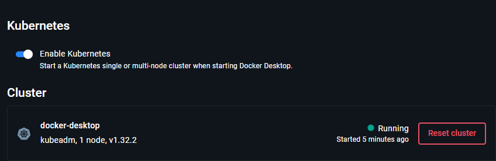
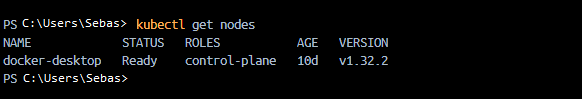
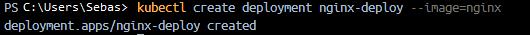
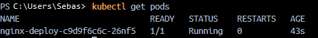
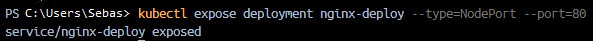
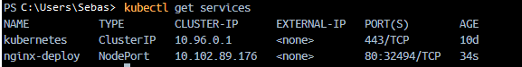
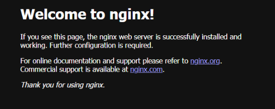
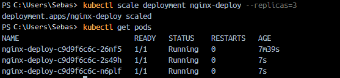

# Introducción Práctica a Kubernetes

En esta guía aprenderás paso a paso cómo desplegar y gestionar una aplicación en Kubernetes. Usare imágenes ilustrativas para comprender cada proceso.

## Preparar el entorno

En esta sección configuraremos el entorno necesario para comenzar a trabajar con Kubernetes.

  
*Minikube iniciado correctamente.*

  
*Verificación de que el clúster está funcionando.*

## Desplegando nuestra primera aplicación

Ahora crearemos y desplegaremos nuestra primera aplicación en Kubernetes utilizando un deployment.

  
*Definimos el archivo de configuración del deployment.*

  
*Aplicación desplegada correctamente con `kubectl apply`.*

  
*Verificamos los pods en ejecución.*

  
*Comprobamos que el servicio está creado y funcionando.*

### Accedemos desde el navegador

Abrimos la aplicación en el navegador utilizando la URL proporcionada por Minikube o el servicio NodePort.

  
*La aplicación se muestra correctamente en el navegador.*

### Escalamos la aplicación

Aumentamos la cantidad de réplicas para escalar horizontalmente la aplicación.

- Aumentamos el número de réplicas a 3 con el siguiente comando:

