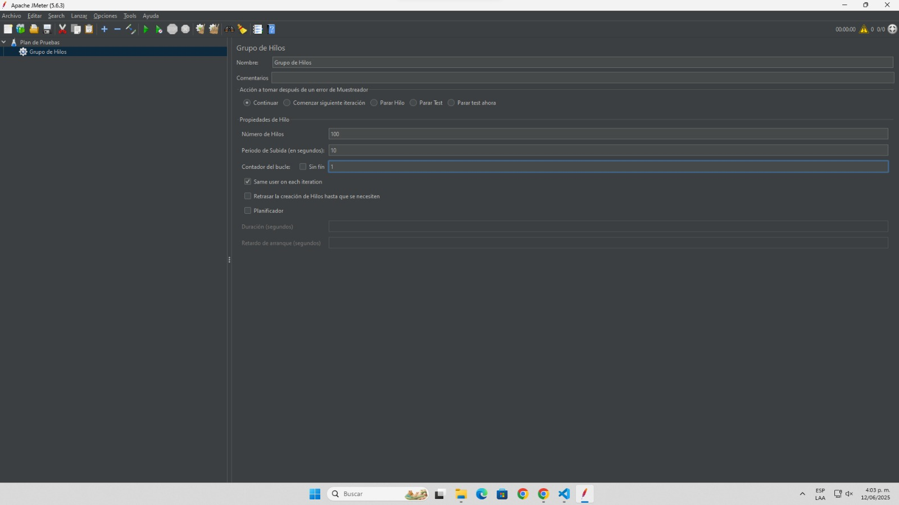
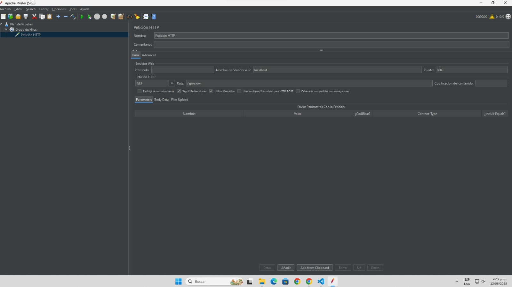
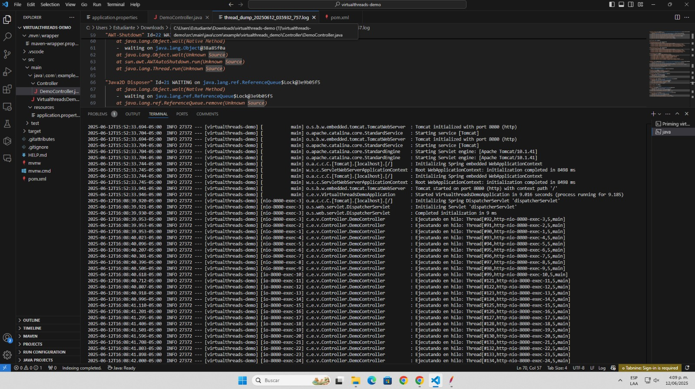
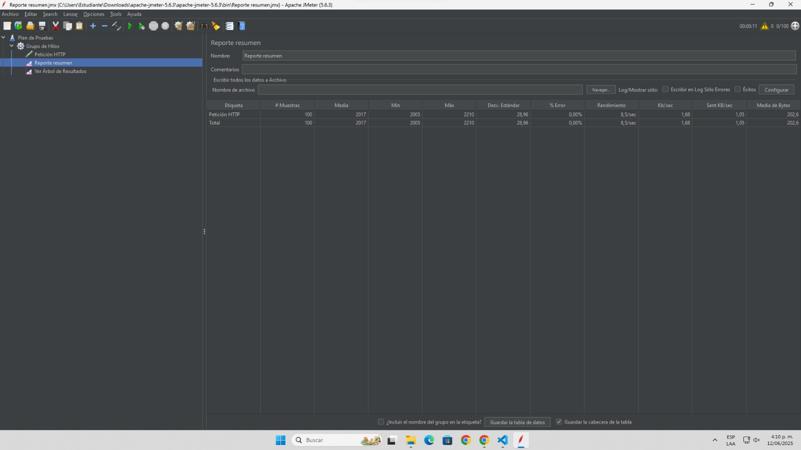
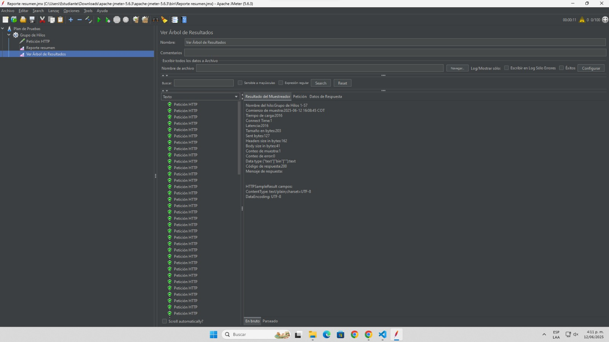

# Virtual Threads en Spring Boot

- **Agrega un Thread Group**  
  

- **Agrega una peticion HTTP**  
  

- **Demo Controller**  
    

- **Reporte Resumen**  
    

- **Arbol de Resultados**  
    

- **Solucion de este codelab**